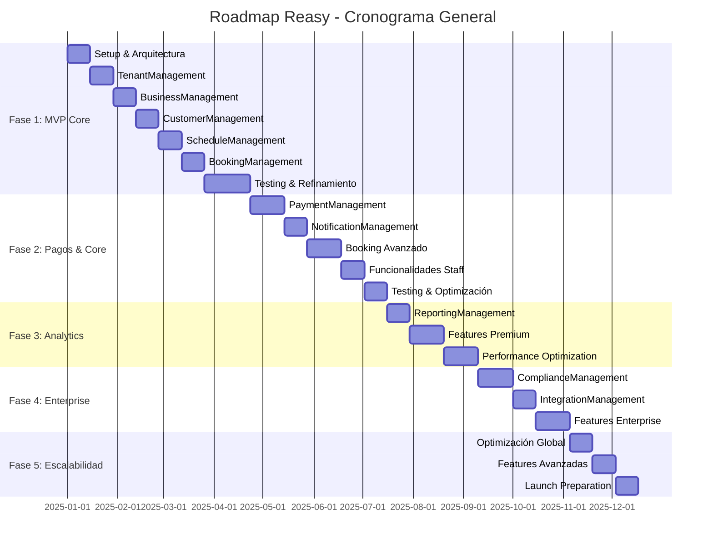

# 🚀 ROADMAP DE DESARROLLO - REASY
## SaaS de Gestión de Reservas Multi-Negocio

> **Stack:** Laravel 12 + Livewire 3 + Alpine.js + PostgreSQL  
> **Arquitectura:** DDD con Bounded Contexts  
> **Duración Total Estimada:** 12-15 meses  
> **Equipo Sugerido:** 4-6 desarrolladores  

---

## 📋 Resumen Ejecutivo

**Objetivo**: Desarrollar un SaaS robusto de gestión de reservas que permita a múltiples negocios gestionar sus operaciones de booking de manera eficiente, con un modelo de monetización escalable.

**Enfoque**: Desarrollo incremental siguiendo principios DDD, priorizando MVP funcional y expandiendo características progresivamente.

---

## 🎯 FASE 1: FUNDACIONES Y MVP CORE
**Duración:** 3-4 meses  
**Objetivo:** Establecer arquitectura base y funcionalidad mínima viable  

### **1.1 Setup Inicial y Arquitectura (Semanas 1-2)**

#### Infraestructura Base
- [x] Configuración Laravel 12 + Livewire 3 + Alpine.js
- [x] Setup PostgreSQL con Docker/Sail
- [x] Configuración de testing con PestPHP
- [x] CI/CD básico con GitHub Actions
- [x] Estructura DDD con Bounded Contexts

#### Configuración de Desarrollo
- [x] Laravel Pint para code style (PSR-12)
- [x] Configuración de strict types
- [x] Setup de debugging y logging
- [x] Configuración de entornos (local, staging, production)

### **1.2 TenantManagement Context (Semanas 3-4)**

#### Entidades Core
```php
// Dominio
- Tenant (Aggregate Root)
- SubscriptionPlan  
- Subscription
- TenantUsage
- TenantLimit
```

#### Funcionalidades Entregables
- **RF1**: Gestión básica de Tenants (crear, ver, suspender)
- **RF2**: Planes de suscripción con límites
- **RF3**: Dashboard básico de plataforma
- Multi-tenancy setup con middleware

#### Criterios de Aceptación
- ✅ Admin puede crear tenants
- ✅ Planes con límites son aplicados automáticamente
- ✅ Dashboard muestra métricas básicas (tenants activos, MRR)
- ✅ Cada tenant opera de forma aislada

### **1.3 BusinessManagement Context (Semanas 5-6)**

#### Entidades Core
```php
// Dominio
- Business (Aggregate Root)
- Location
- Service
- ServiceCategory
- Resource
- BusinessUser
```

#### Funcionalidades Entregables
- **RF11**: Configuración básica del negocio
- **RF12**: Gestión de una sede principal
- **RF13**: CRUD de servicios básicos
- **RF14**: Gestión de recursos (staff inicial)
- **RF16**: Invitación de empleados por email

#### Criterios de Aceptación
- ✅ Tenant admin puede configurar su negocio
- ✅ Puede crear servicios con duración y precio
- ✅ Puede agregar recursos (staff)
- ✅ Empleados pueden ser invitados y acceder al sistema

### **1.4 CustomerManagement Context (Semanas 7-8)**

#### Entidades Core
```php
// Dominio
- Customer (Aggregate Root)
- CustomerProfile
- CustomerPreference
```

#### Funcionalidades Entregables
- **RF36**: Autenticación básica de clientes
- **RF37**: Perfil de usuario básico
- **RF46**: Flujo de reserva como guest (datos mínimos)
- **RF47**: Verificación por OTP

#### Criterios de Aceptación
- ✅ Clientes pueden registrarse y hacer login
- ✅ Guests pueden hacer reservas con datos mínimos
- ✅ Verificación por email/SMS funcional
- ✅ Perfiles básicos se crean correctamente

### **1.5 ScheduleManagement Context (Semanas 9-10)**

#### Entidades Core
```php
// Dominio
- Schedule (Aggregate Root)
- WorkingHours
- TimeSlot
- Availability
```

#### Funcionalidades Entregables
- **RF15**: Gestión básica de horarios
- Motor de disponibilidad simple
- Generación de slots disponibles
- Validación de conflictos

#### Criterios de Aceptación
- ✅ Admin puede configurar horarios de trabajo
- ✅ Sistema genera slots disponibles correctamente
- ✅ No permite doble bookings
- ✅ Respeta horarios configurados

### **1.6 BookingManagement Context (Semanas 11-12)**

#### Entidades Core
```php
// Dominio
- Booking (Aggregate Root)
- BookingStatus
- CancellationPolicy
```

#### Funcionalidades Entregables
- **RF38**: Flujo básico de reserva
- **RF48**: Selección de servicio y horario
- **RF50**: Proceso sin depósito inicialmente
- **RF51**: Confirmación por email
- Estados básicos (draft, confirmed, cancelled, completed)

#### Criterios de Aceptación
- ✅ Clientes pueden crear reservas
- ✅ Confirmación automática por email
- ✅ Vista calendario funcional
- ✅ Estados de reserva se manejan correctamente

### **1.7 Testing y Refinamiento (Semanas 13-16)**

#### Testing Exhaustivo
- Unit tests para toda la lógica de dominio
- Feature tests para flujos end-to-end
- Performance testing básico
- Security testing inicial

#### Refinamiento MVP
- Bugs fixing y optimizaciones
- UX/UI improvements
- Documentación técnica
- Preparación para deploy

#### **🎉 Entregable Fase 1: MVP Funcional**
- Sistema multi-tenant operativo
- Gestión básica de negocios y servicios
- Reservas sin pagos
- Panel administrativo básico
- Autenticación y autorización
- Testing coverage > 80%

---

## 🚀 FASE 2: FUNCIONALIDADES CORE Y PAGOS
**Duración:** 3-4 meses  
**Objetivo:** Agregar sistema de pagos, notificaciones y funcionalidades esenciales  

### **2.1 PaymentManagement Context (Semanas 1-3)**

#### Entidades Core
```php
// Dominio
- Payment (Aggregate Root)
- PaymentMethod
- Refund
- Invoice
- Transaction
```

#### Funcionalidades Entregables
- **RF50**: Integración con Stripe (depósitos)
- **RF21**: Configuración de pagos por tenant
- Procesamiento de reembolsos automáticos
- Facturación básica

#### Criterios de Aceptación
- ✅ Depósitos funcionan con Stripe
- ✅ Reembolsos automáticos según políticas
- ✅ Tenants pueden configurar sus cuentas Stripe
- ✅ Facturas se generan correctamente

### **2.2 NotificationManagement Context (Semanas 4-5)**

#### Entidades Core
```php
// Dominio
- Notification (Aggregate Root)
- NotificationTemplate
- NotificationChannel
- CommunicationPreference
```

#### Funcionalidades Entregables
- **RF22**: Plantillas personalizables
- **RF31**: Notificaciones en tiempo real
- **RF43**: Recordatorios programados
- Email + SMS + Push notifications

#### Criterios de Aceptación
- ✅ Emails transaccionales funcionan
- ✅ SMS con Twilio configurado
- ✅ Plantillas personalizables por tenant
- ✅ Recordatorios automáticos

### **2.3 Funcionalidades Avanzadas de Booking (Semanas 6-8)**

#### Expansión de BookingManagement
- **RF40**: Autogestión de reservas (cancelar/reprogramar)
- **RF52**: Políticas de cancelación configurables
- **RF26**: Sistema de waitlist básico
- **RF53**: Booking múltiple

#### Criterios de Aceptación
- ✅ Clientes pueden cancelar y reprogramar
- ✅ Políticas de cancelación se aplican correctamente
- ✅ Waitlist funciona automáticamente
- ✅ Bookings múltiples coordinados

### **2.4 Funcionalidades Staff (Semanas 9-10)**

#### Expansión para Empleados
- **RF27**: Vista calendario personal
- **RF28**: Gestión de citas propias
- **RF29**: Estados de cita (completada/no-show)
- **RF30**: Gestión de disponibilidad personal

#### Criterios de Aceptación
- ✅ Empleados ven su calendario personal
- ✅ Pueden marcar estados de citas
- ✅ Gestión de disponibilidad funcional
- ✅ Notificaciones a empleados

### **2.5 Testing y Optimización (Semanas 11-12)**

#### Testing Avanzado
- Payment testing con Stripe Test Mode
- Load testing para concurrencia
- Security testing para pagos (PCI compliance)
- Integration testing entre contextos

#### **🎉 Entregable Fase 2: Sistema de Pagos Completo**
- Procesamiento de pagos con Stripe
- Sistema de notificaciones multi-canal
- Gestión avanzada de reservas
- Panel para empleados
- Políticas de cancelación configurables

---

## 📊 FASE 3: ANALYTICS Y FUNCIONALIDADES AVANZADAS
**Duración:** 2-3 meses  
**Objetivo:** Reportes, analytics, funcionalidades premium  

### **3.1 ReportingManagement Context (Semanas 1-2)**

#### Entidades Core
```php
// Dominio
- Report (Aggregate Root)
- Dashboard
- Metric
- KPI
- DataExport
```

#### Funcionalidades Entregables
- **RF20**: Dashboard de negocio avanzado
- **RF23**: Reportes financieros
- **RF32**: Seguimiento de comisiones
- Exportación de datos

#### Criterios de Aceptación
- ✅ Dashboards con KPIs en tiempo real
- ✅ Reportes exportables (PDF, Excel)
- ✅ Métricas de performance por empleado
- ✅ Análisis de rentabilidad

### **3.2 Funcionalidades Premium (Semanas 3-5)**

#### Características Avanzadas
- **RF24**: Gestión de inventario básica
- **RF25**: Marketing automation básico
- **RF42**: Programa de fidelidad
- **RF44**: Social features básicas

#### Criterios de Aceptación
- ✅ Control de stock para productos
- ✅ Campañas de email automáticas
- ✅ Puntos de fidelidad funcionan
- ✅ Reviews y ratings

### **3.3 Optimizaciones de Performance (Semanas 6-8)**

#### Performance y Escalabilidad
- Caching strategy (Redis)
- Database optimization y indexing
- Queue system para jobs pesados
- API rate limiting

#### **🎉 Entregable Fase 3: Plataforma Avanzada**
- Sistema de reportes completo
- Funcionalidades premium operativas
- Performance optimizado
- Caching multi-layer

---

## 🔐 FASE 4: COMPLIANCE Y ENTERPRISE
**Duración:** 2-3 meses  
**Objetivo:** Cumplimiento regulatorio, seguridad y funcionalidades enterprise  

### **4.1 ComplianceManagement Context (Semanas 1-3)**

#### Entidades Core
```php
// Dominio
- AuditLog (Aggregate Root)
- ComplianceRequest
- DataRetentionPolicy
- PrivacyConsent
```

#### Funcionalidades Entregables
- **RF58**: Audit trail completo
- **RF59**: GDPR compliance
- **RNF7**: Seguridad avanzada (MFA, RBAC)
- Data retention policies

#### Criterios de Aceptación
- ✅ Logs inmutables de auditoría
- ✅ GDPR requests automatizados
- ✅ MFA obligatorio para admins
- ✅ Políticas de retención configurables

### **4.2 IntegrationManagement Context (Semanas 4-5)**

#### Entidades Core
```php
// Dominio
- Integration (Aggregate Root)
- APIKey
- Webhook
- ExternalService
```

#### Funcionalidades Entregables
- **RF56**: Developer portal
- **RF57**: Marketplace de apps básico
- API públicas documentadas
- Webhook system

#### Criterios de Aceptación
- ✅ APIs públicas documentadas
- ✅ Webhook system funcional
- ✅ Developer portal operativo
- ✅ SDK básico disponible

### **4.3 Features Enterprise (Semanas 6-8)**

#### Funcionalidades Premium
- **RF4**: Facturación automática enterprise
- **RF10**: Analytics predictivo básico
- White-label customization
- SSO enterprise

#### **🎉 Entregable Fase 4: Plataforma Enterprise**
- Compliance regulatorio completo
- APIs públicas y integraciones
- Funcionalidades enterprise
- White-label capabilities

---

## 🌐 FASE 5: ESCALABILIDAD Y OPTIMIZACIÓN
**Duración:** 2-3 meses  
**Objetivo:** Optimización final, escalabilidad global, features avanzadas  

### **5.1 Optimización Global (Semanas 1-2)**

#### Infraestructura
- Multi-region deployment
- CDN integration
- Database sharding por tenant
- Advanced monitoring (APM)

#### Criterios de Aceptación
- ✅ Deployment en múltiples regiones
- ✅ CDN para assets estáticos
- ✅ Database performance optimizado
- ✅ Monitoring avanzado

### **5.2 Features Avanzadas (Semanas 3-4)**

#### Funcionalidades Finales
- AI-powered scheduling optimization
- Advanced analytics con ML
- Mobile app (React Native)
- Multi-language support

### **5.3 Launch Preparation (Semanas 5-6)**

#### Go-to-Market
- Load testing exhaustivo
- Security auditing externo
- Documentation finalizada
- Training materials

#### **🎉 Entregable Final: Plataforma Production-Ready**
- Escalabilidad global
- Features avanzadas con AI/ML
- Mobile app nativa
- Documentación completa

---

## 📅 CRONOGRAMA DETALLADO



---

## 🎯 OBJETIVOS Y MÉTRICAS POR FASE

### **Fase 1 - MVP Core**
**Objetivos:**
- Sistema multi-tenant funcional
- Reservas básicas sin pagos
- Autenticación completa

**Métricas de Éxito:**
- ✅ 100% de tests unitarios pasan
- ✅ Tiempo de respuesta < 200ms para operaciones básicas
- ✅ 5 tenants de prueba operando simultáneamente
- ✅ 0 bugs críticos

### **Fase 2 - Pagos & Core**
**Objetivos:**
- Sistema de pagos seguro
- Notificaciones multi-canal
- Funcionalidades staff

**Métricas de Éxito:**
- ✅ Procesamiento de pagos 99.9% exitoso
- ✅ Notificaciones entregadas < 30 segundos
- ✅ Performance mantiene < 500ms
- ✅ PCI compliance básico

### **Fase 3 - Analytics**
**Objetivos:**
- Reportes en tiempo real
- Funcionalidades premium
- Performance optimizado

**Métricas de Éxito:**
- ✅ Dashboards cargan < 2 segundos
- ✅ Reportes exportan < 10 segundos
- ✅ 100 usuarios concurrentes sin degradación
- ✅ Caching hit rate > 80%

### **Fase 4 - Enterprise**
**Objetivos:**
- Compliance completo
- APIs públicas
- Integraciones enterprise

**Métricas de Éxito:**
- ✅ GDPR compliance verificado externamente
- ✅ APIs con 99.95% uptime
- ✅ Audit trail completo sin lagunas
- ✅ SSO funcional con 5+ providers

### **Fase 5 - Escalabilidad**
**Objetivos:**
- Escalabilidad global
- Features avanzadas
- Production ready

**Métricas de Éxito:**
- ✅ 10,000 usuarios concurrentes
- ✅ Multi-region deployment exitoso
- ✅ Performance < 100ms global
- ✅ 99.99% uptime en production

---

## 👥 EQUIPO SUGERIDO

### **Team Lead + Arquitecto** (1)
- Responsible for technical decisions
- DDD architecture oversight
- Code review y quality gates
- DevOps y deployment strategy

### **Backend Developers** (2-3)
- Laravel + Livewire experts
- DDD implementation
- API development
- Database optimization

### **Frontend Developer** (1)
- Livewire 3 + Alpine.js
- UI/UX implementation
- Mobile-responsive design
- Performance optimization

### **QA Engineer** (1)
- Test automation (PestPHP)
- Performance testing
- Security testing
- User acceptance testing

### **DevOps Engineer** (0.5)
- CI/CD pipelines
- Infrastructure as Code
- Monitoring y observability
- Security hardening

---

## 🔧 STACK TÉCNICO DEFINITIVO

### **Backend**
- **Framework:** Laravel 12
- **Frontend:** Livewire 3 + Alpine.js
- **Base de Datos:** PostgreSQL 15+
- **Cache:** Redis 7+
- **Queue:** Laravel Queues con Redis
- **Testing:** PestPHP

### **Infraestructura**
- **Containerización:** Docker + Laravel Sail
- **CI/CD:** GitHub Actions
- **Deployment:** AWS ECS/EKS o Digital Ocean
- **CDN:** CloudFlare
- **Monitoring:** Laravel Telescope + Sentry

### **Integraciones**
- **Pagos:** Stripe (primario), PayPal (secundario)
- **Comunicaciones:** Twilio (SMS), SendGrid (Email)
- **Analytics:** Mixpanel o Google Analytics
- **Logging:** Elasticsearch + Logstash + Kibana

---

## 📋 CRITERIOS DE DEFINITION OF DONE

Para cada feature consideramos "Done" cuando:

### **Código**
- ✅ Implementación sigue principios DDD
- ✅ Strict types habilitado
- ✅ PSR-12 compliance (Laravel Pint)
- ✅ Code review aprobado
- ✅ Sin warnings de static analysis

### **Testing**
- ✅ Unit tests para lógica de dominio
- ✅ Feature tests para flujos end-to-end
- ✅ Coverage > 85% para nuevo código
- ✅ Performance tests pasan

### **Documentación**
- ✅ API documentation actualizada
- ✅ README técnico actualizado
- ✅ Architectural Decision Records (ADRs)
- ✅ Deployment guide actualizado

### **Seguridad**
- ✅ Security review completado
- ✅ Dependencies actualizadas
- ✅ Static analysis security scan
- ✅ Credentials y secrets configurados

### **Performance**
- ✅ Load testing realizado
- ✅ Performance benchmarks cumplidos
- ✅ Memory usage dentro de límites
- ✅ Database queries optimizadas

---

## 🚨 RIESGOS Y MITIGACIONES

### **Riesgos Técnicos**

| Riesgo                        | Probabilidad | Impacto | Mitigación                                |
| ----------------------------- | ------------ | ------- | ----------------------------------------- |
| Complejidad DDD               | Media        | Alto    | Capacitación equipo, arquitecto dedicado  |
| Performance con multi-tenancy | Alta         | Alto    | Testing temprano, profiling continuo      |
| Integración pagos             | Media        | Alto    | Sandbox testing exhaustivo, rollback plan |
| Escalabilidad database        | Alta         | Alto    | Sharding strategy, read replicas          |

### **Riesgos de Negocio**

| Riesgo               | Probabilidad | Impacto | Mitigación                                |
| -------------------- | ------------ | ------- | ----------------------------------------- |
| Cambio de requisitos | Alta         | Medio   | Desarrollo ágil, feedback loops cortos    |
| Competencia          | Media        | Alto    | MVP rápido, diferenciación clara          |
| Tiempo de desarrollo | Media        | Alto    | Buffer en estimaciones, scope flexibility |
| Adopción lenta       | Media        | Alto    | UX research, beta testing                 |

---

## 📈 MÉTRICAS DE PROGRESO

### **Métricas de Desarrollo**
- **Velocity:** Story points completados por sprint
- **Quality:** Bug rate, code coverage, review time
- **Performance:** Response times, throughput, error rate
- **Technical Debt:** SonarQube metrics, dependency health

### **Métricas de Producto**
- **Funcionalidad:** Features completadas vs. planificadas
- **User Experience:** Task completion rate, user satisfaction
- **Performance:** Page load times, API response times
- **Reliability:** Uptime, error rate, recovery time

---

## 🎉 HITOS PRINCIPALES

### **🎯 Hito 1: MVP Release (Mes 4)**
- Sistema multi-tenant operativo
- Reservas básicas funcionales
- Authentication/authorization completo
- Deploy en staging environment

### **🎯 Hito 2: Payment Integration (Mes 8)**
- Stripe integration completa
- Notificaciones multi-canal
- Funcionalidades staff operativas
- Beta testing con clientes reales

### **🎯 Hito 3: Full Platform (Mes 11)**
- Reportes y analytics completos
- Funcionalidades premium
- Performance optimizado
- Compliance básico implementado

### **🎯 Hito 4: Enterprise Ready (Mes 14)**
- GDPR compliance completo
- APIs públicas documentadas
- Integraciones enterprise
- Security audit aprobado

### **🎯 Hito 5: Production Launch (Mes 17)**
- Escalabilidad global
- Mobile app disponible
- Go-to-market executed
- Customer success programa activo

---

**💡 Nota:** Este roadmap es una guía inicial que debe ser refinada basada en feedback del equipo, stakeholders y resultados de cada fase. La flexibilidad y adaptación son clave para el éxito del proyecto.
